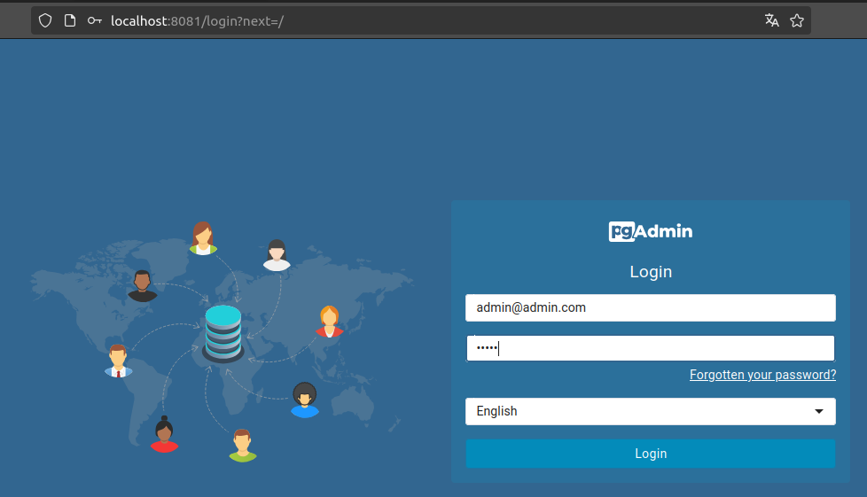
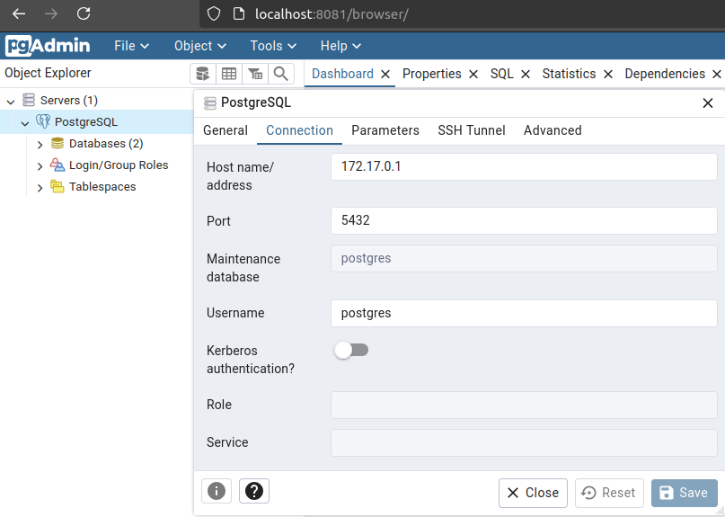

# Tutorial: Configurando um Ambiente PostgreSQL e pgAdmin com Docker

## Introdução

Este guia descreve como configurar PostgreSQL e pgAdmin usando Docker. Vamos abordar desde a instalação do Docker, execução de containers usando linha de comando e Docker Compose, até operações CRUD e a remoção de containers e imagens.

## O que é PostgreSQL?

PostgreSQL é um sistema de gerenciamento de banco de dados relacional e objeto de código aberto, altamente extensível e com suporte a SQL completo. 

Ele é conhecido por sua robustez, desempenho e conformidade com os padrões SQL. O PostgreSQL suporta transações ACID, replicação, índices avançados, tipos de dados complexos e muito mais, tornando-o uma escolha popular para aplicações de todos os tamanhos e complexidades.

## Quais ferramentas utilizaremos?

- Docker
- Docker Compose
- PostgreSQL
- Instruções SQL (CRUD)
- pgAdmin

## Instalação do Docker

**No Ubuntu**

1. Atualize os pacotes:

```sh
sudo apt update
```

2. Instale o Docker:

```sh
sudo apt install docker.io
```

3. Verifique a instalação do Docker:

```sh
docker --version
```

## Configurando PostgreSQL

###  Usando linha de comando

1. Baixe a imagem do PostgreSQL:

```sh
docker pull postgres
```

2. Execute o container do PostgreSQL:

```sh
docker run --name meu-postgres -e POSTGRES_PASSWORD=minha_senha -d -p 5432:5432 postgres
```

Nesse comando:

  - **--name** define o nome do container.
  - **-e POSTGRES_PASSWORD** define a senha do usuário postgres.
  - **-d** roda o container em modo "detached" (em segundo plano).
  - **-p 5432:5432** mapeia a porta 5432 do container para a porta 5432 do host.

### Usando Docker Compose

1. Crie um arquivo **docker-compose.yml** com o seguinte conteúdo:

```yaml
version: '3.1'

services:
  postgres:
    image: postgres
    container_name: meu-postgres
    environment:
      POSTGRES_PASSWORD: minha_senha
    ports:
      - "5432:5432"
```

2. Inicie o container

```sh
docker-compose up -d
```

### Consultas de Database e Tabelas

Conecte-se ao PostgreSQL no container no modo interativo:

```sh
docker exec -it meu-postgres psql -U postgres
```

### Verificando databases existentes:

```sh
\l
```

### Criando uma nova database:

```sql
CREATE DATABASE produtos_db;
\c produtos_db
```

### Operações CRUD:

Crie as tabelas de exemplo fabricante e produto:

```sql
CREATE TABLE fabricante (
    id SERIAL PRIMARY KEY,
    nome TEXT NOT NULL,
    pais TEXT
);

CREATE TABLE produto (
    id SERIAL PRIMARY KEY,
    nome TEXT NOT NULL,
    fabricante_id INTEGER REFERENCES fabricante(id)
);
```

Inserindo Dados (Create)

```sql
INSERT INTO fabricante (nome, pais) VALUES ('Fabricante A', 'Brasil');
INSERT INTO fabricante (nome, pais) VALUES ('Fabricante B', 'EUA');
INSERT INTO fabricante (nome, pais) VALUES ('Fabricante C', 'Alemanha');

INSERT INTO produto (nome, fabricante_id) VALUES ('Produto 1', 2);
INSERT INTO produto (nome, fabricante_id) VALUES ('Produto 2', 2);
INSERT INTO produto (nome, fabricante_id) VALUES ('Produto 3', 3);
```

Consultando os dados inseridos:

```sql
SELECT * FROM fabricante;
SELECT * FROM produto;
SELECT * FROM produto WHERE fabricante_id = 2;
```

Atualizando os dados inseridos:

```sql
UPDATE fabricante SET nome = 'Fabricante A Modificado', pais = 'Brasil Modificado' WHERE id = 1;
UPDATE produto SET nome = 'Produto 1 Modificado', fabricante_id = 3 WHERE id = 1;
```

Excluindo os dados:

```sql
DELETE FROM fabricante WHERE id = 1;
DELETE FROM produto WHERE id = 1;
```

## Configurando pgAdmin

### O que é pgAdmin?

pgAdmin é uma ferramenta de administração e desenvolvimento de código aberto para PostgreSQL. 

Ele fornece uma interface gráfica para gerenciar bancos de dados PostgreSQL, permitindo que os usuários criem, editem e visualizem objetos de banco de dados, executem consultas SQL, gerenciem permissões de usuário e realizem outras tarefas administrativas. 

Existem outras ferramentas equivalentes:

- **DBeaver**: Um gerenciador de banco de dados universal que suporta vários bancos de dados, incluindo PostgreSQL.

- **HeidiSQL**: Uma ferramenta leve e poderosa para gerenciar bancos de dados MySQL, MariaDB, PostgreSQL e SQL Server.

### Usando linha de comando

1. Baixe e inicie o container do pgAdmin. Vamos usar a porta **8081** da máquina local para evitar conflito com outras aplicações que possam estar usando a porta **8080**:

```sh
docker run --name pgadmin4 -e PGADMIN_DEFAULT_EMAIL=admin@admin.com -e PGADMIN_DEFAULT_PASSWORD=admin -d -p 8081:80 dpage/pgadmin4
```

Nesse comando:

  - **--name** define o nome do container.
  - **-p 8081:80** mapeia a porta 80 do container para a porta 8081 do host.
  - **-e 'PGADMIN_DEFAULT_EMAIL=admin@admin.com'** define o email padrão para login.
  - **-e 'PGADMIN_DEFAULT_PASSWORD=admin'** define a senha padrão para login.
  - **-d** roda o container em modo "detached" (em segundo plano).

### Usando Docker Compose

Adicione o serviço do pgAdmin ao arquivo **docker-compose**.yml:

```yml
version: '3.1'

services:
  postgres:
    image: postgres
    container_name: meu-postgres
    environment:
      POSTGRES_PASSWORD: minha_senha
    ports:
      - "5432:5432"

  pgadmin:
    image: dpage/pgadmin4
    container_name: pgadmin4
    environment:
      PGADMIN_DEFAULT_EMAIL: admin@admin.com
      PGADMIN_DEFAULT_PASSWORD: admin
    ports:
      - "8081:80"
```

Inicie o container:

```sh
docker-compose up -d
```

### Configurando a conexão no pgAdmin

1. Acesse o pgAdmin por um navegador e acesse http://localhost:8081. Use as credenciais que definimos (admin@admin.com e admin) para fazer login.

- Faça login com:
    - **Email**: admin@admin.com
    - **Password**: admin

    <br>

    

2. Depois de fazer login no pgAdmin, adicione um servidor PostgreSQL:

- Clique com o botão direito em "Servers" e selecione "Create" > "Server".
- Na aba "General", dê um nome ao servidor.
- Na aba "Connection", insira os detalhes de conexão do seu servidor PostgreSQL:

    - **Name**: PostgreSQL Docker
    - **Host name/address**: host.docker.internal (ou 172.17.0.1 no Linux)
    - **Port**: 5432
    - **Maintenance database**: postgres
    - **Username**: postgres
    - **Password**: a senha que foi definida ao rodar o container do PostgreSQL, em nosso exemplo, *minha_senha*

    <br>

  

### Parando e Reiniciando os Containers

Parar os Containers sem removê-los:

```sh
docker stop meu-postgres pgadmin4
```

### Reiniciando os Containers

Reiniciar os containers parados:

```sh
docker start meu-postgres pgadmin4
```

Se estiver usando Docker Compose, podemos parar e reiniciar os containers usando:

```sh
docker-compose stop
docker-compose start
```

### Removendo Containers e Imagens

Parar e remover os containers:

```sh
docker stop meu-postgres pgadmin4
docker rm meu-postgres pgadmin4
```

### Removendo as imagens utilizadas

```sh
docker rmi postgres dpage/pgadmin4
```

Se preferir remover todas as imagens existentes além das que utilizadmos:

```sh
docker rmi $(docker images -q)
```

#### Usando Docker Compose

Para parar e remover todos os containers e redes definidos no arquivo docker-compose.yml:

```sh
docker-compose down
```

Para remover as imagens utilizadas:

```sh
docker-compose down --rmi local
```

**Alerta**: Caso a porta **8081** utilizada pelo pgAdmin fique alocada informando que já está sendo utilizada após a paralização do container, use o comando abaixo para liberá-la:

```sh
kill -9 $(lsof -t -i:8081)
```

## Conclusão

Este breve tutorial cobre todos os passos necessários para configurar PostgreSQL e pgAdmin com Docker, realizar operações CRUD, parar e reiniciar containers, e limpar o ambiente.
